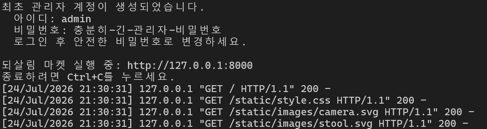
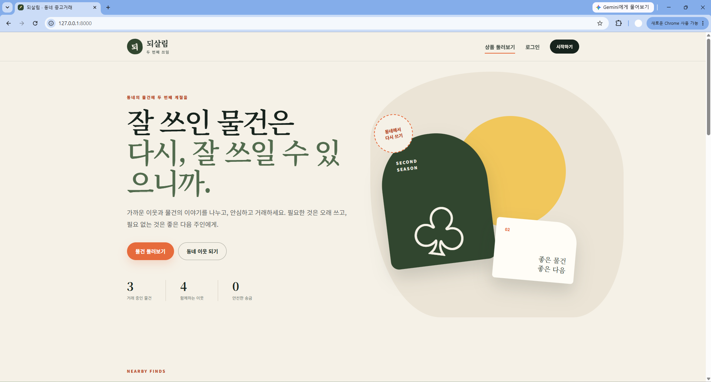
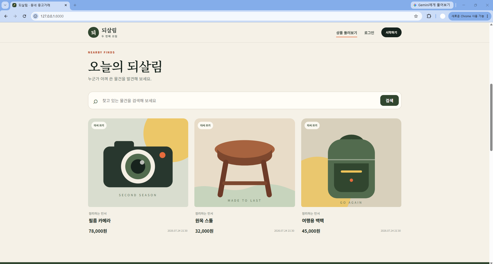
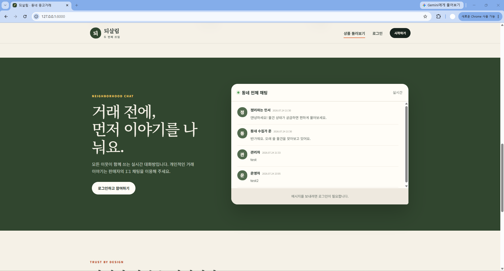
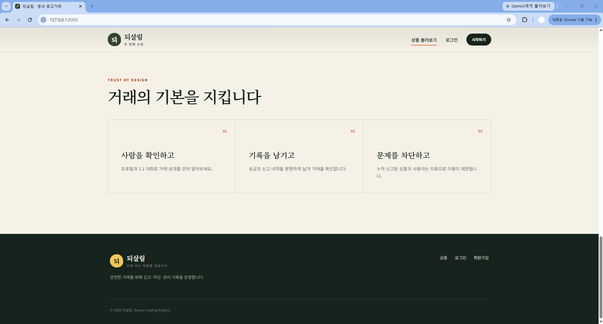

# 되살림 — Tiny Second-hand Shopping Platform

-  화이트햇스쿨 4기 [김도현 (@Elio217)](https://github.com/Elio217)

github 링크 : https://github.com/Elio217/secure-coding
본 과제는 codex의 도움을 받아 완성했습니다.

# 1. 요구사항 분석

| 요구사항 | 구현 내용 |
| --- | --- |
| 회원가입 및 로그인 | 아이디 중복 확인, 회원가입 및 로그인 기능 구현 |
| 사용자 조회 | 사용자 목록 검색 및 프로필 조회 기능 구현 |
| 마이페이지 | 계정명, 소개글 및 비밀번호 수정 기능 구현 |
| 상품 등록 | 상품명, 설명, 가격, 사진을 입력하여 상품 등록 |
| 상품 관리 | 자신이 등록한 상품의 조회, 수정 및 삭제 기능 구현 |
| 상품 조회 | 전체 상품 목록 및 상품 상세 페이지 구현 |
| 상품 검색 | 상품명과 상품 설명을 이용한 검색 기능 구현 |
| 전체 채팅 | 모든 사용자가 참여할 수 있는 실시간 채팅 구현 |
| 1대1 채팅 | 사용자 간 개인 채팅 기능 구현 |
| 사용자 및 상품 신고 | 신고 대상과 신고 사유를 저장하는 기능 구현 |
| 악성 대상 차단 | 서로 다른 사용자의 신고가 3회 누적되면 임시 제한하고 관리자가 유지 또는 복구 |
| 사용자 간 송금 | 가상 잔액을 이용한 송금 및 송금 내역 조회 구현 |
| 관리자 기능 | 사용자, 상품, 신고, 채팅 관리 및 송금 기록 조회 구현 |
| 데이터베이스 | 사용자, 상품, 신고, 채팅, 송금 및 세션 정보를 SQLite로 관리 |
| 보안 | 비밀번호 해시, CSRF 방어, 접근 권한 및 입력값 검증 적용 |

# 2. 시스템 설계

## 2.1 시스템 구조

| 구성 요소 | 설계 내용 |
| --- | --- |
| 프론트엔드 | HTML, CSS, JavaScript와 Jinja2 템플릿 사용 |
| 백엔드 | Python HTTP 서버에서 요청 처리, 입력값 검증 및 권한 확인 |
| 데이터베이스 | SQLite를 사용하여 사용자, 상품, 채팅, 신고, 송금 정보 저장 |
| 이미지 저장소 | 검증된 상품 이미지를 `instance/uploads`에 저장 |
| 실시간 통신 | Server-Sent Events를 사용하여 전체 채팅 메시지 전달 |

```text
사용자 브라우저
      ↓
Python HTTP 서버
      ↓
인증·권한·입력값 검증
      ↓
서비스 기능 처리
      ↓
SQLite 데이터베이스
      ↓
HTML 또는 JSON 응답
```

## 2.2 데이터베이스 설계

| 테이블 | 저장 정보 |
| --- | --- |
| `users` | 아이디, 계정명, 비밀번호 해시, 소개글, 역할, 상태, 잔액 |
| `products` | 상품명, 설명, 가격, 사진 경로, 판매자, 상태, 신고 횟수 |
| `messages` | 발신자, 수신자, 메시지 내용, 작성 시각 |
| `reports` | 신고자, 신고 대상 유형, 대상 아이디, 신고 사유, 처리 상태 |
| `transfers` | 보낸 사용자, 받은 사용자, 송금 금액, 메모, 중복 방지 토큰 해시 |
| `sessions` | 로그인 세션 토큰 해시와 만료 시각 |
| `audit_logs` | 사용자 및 관리자의 주요 작업 기록 |
| `request_events` | 요청 제한 유형, 식별자 해시와 요청 시각 |

전체 채팅은 `messages` 테이블의 수신자를 비워 저장하고, 1대1 채팅은 수신자 아이디를 저장하도록 설계하였다.

## 2.3 주요 기능 설계

| 기능 | 설계 내용 |
| --- | --- |
| 회원가입 | 아이디 중복과 비밀번호 조건을 확인한 후 사용자 저장 |
| 로그인 | 비밀번호 해시를 검증하고 로그인 세션 생성 |
| 상품 관리 | 로그인한 사용자만 상품을 등록하며, 판매자만 수정·삭제 가능 |
| 상품 검색 | 상품명과 상품 설명을 기준으로 거래 가능한 상품 검색 |
| 전체 채팅 | 새로운 메시지를 Server-Sent Events로 실시간 전달 |
| 1대1 채팅 | 발신자와 수신자 아이디를 기준으로 대화 내용 조회 |
| 신고 | 사용자와 상품을 구분하여 신고하고 중복 신고 방지 |
| 신고 누적 제한 | 서로 다른 사용자의 신고가 3회 누적되면 임시 제한하고 관리자가 최종 검토 |
| 송금 | 하나의 데이터베이스 트랜잭션에서 송금자와 수신자의 잔액 변경 |
| 관리자 | 사용자·상품·신고·채팅을 관리하고 송금 기록 조회 |

## 2.4 보안 설계

| 항목 | 설계 내용 |
| --- | --- |
| 비밀번호 | `scrypt` 해시를 사용하여 저장 |
| 세션 | 세션 원문 대신 해시값을 데이터베이스에 저장 |
| CSRF | 모든 데이터 변경 요청에 CSRF 토큰 적용 |
| 접근 제어 | 로그인 상태, 상품 소유자 및 관리자 권한 확인 |
| 입력값 | 문자열 길이, 숫자 범위 및 파일 형식 검증 |
| 이미지 | PNG, JPEG, WebP의 파일 구조·크기·해상도를 확인하고 무작위 파일명 사용 |
| 데이터베이스 | 모든 SQL 요청에 매개변수 바인딩 적용 |
| 송금 | 잔액 확인과 잔액 변경을 하나의 트랜잭션으로 처리 |
| 출력값 | 템플릿 자동 이스케이프를 적용하여 스크립트 실행 방지 |
| 요청 제한 | 회원가입·로그인·신고·채팅 제한 기록을 SQLite에 저장 |
| 연결 제한 | 채팅 스트림과 서버 전체 동시 작업 수 제한 |
| 운영 설정 | 운영 모드에서 보안 쿠키·HSTS를 적용하고 데모 데이터 생성 차단 |
| 기록 | 중요 작업을 감사 로그에 저장 |

# 3. 구현

## 3.1 구현 환경

별도의 데이터베이스 서버 없이 실행할 수 있도록 Python과 SQLite를 사용하였다. 화면은 HTML, CSS, JavaScript 및 Jinja2 템플릿으로 구성했으며, 전체 채팅에는 Server-Sent Events를 적용하였다.

- 개발 언어: Python 3.12
- 웹 서버: 동시 작업 수를 제한한 Python `BoundedThreadingHTTPServer`
- 화면 구성: HTML, CSS, JavaScript, Jinja2
- 이미지 처리: Pillow 12.3.0
- 데이터베이스: SQLite
- 실시간 채팅: Server-Sent Events
- 테스트: Python `unittest`

## 3.2 프로젝트 구성

```text
.
├── app.py                    # 요청 처리, 라우팅, 입력값 및 권한 검증
├── marketplace/
│   ├── db.py                 # 데이터베이스 스키마와 초기화
│   └── security.py           # 비밀번호, 토큰, 요청 제한
├── templates/                # 페이지별 HTML 템플릿
├── static/                   # CSS, JavaScript, 화면 이미지
├── instance/uploads/         # 사용자가 등록한 상품 이미지
└── tests/                    # 단위 테스트 및 통합 테스트
```

## 3.3 회원 및 사용자 기능

회원가입 시 아이디 형식과 중복 여부, 비밀번호 조건을 검사한 후 사용자 정보를 저장한다. 로그인 시에는 입력된 비밀번호와 저장된 비밀번호 해시를 비교하여 세션을 발급한다.

로그인한 사용자는 다른 사용자를 검색하고 프로필을 조회할 수 있다. 마이페이지에서는 계정명과 소개글, 비밀번호를 변경하고 자신이 등록한 상품을 관리할 수 있다.

## 3.4 상품 기능

사용자는 상품명, 설명, 가격, 사진을 입력하여 상품을 등록할 수 있다. 등록된 상품은 기본 페이지의 상품 목록에 표시되며, 검색어를 이용해 상품명과 설명을 검색할 수 있다.

상품 상세 페이지에서는 판매자와 상품 정보를 확인할 수 있다. 상품 수정과 삭제는 해당 상품을 등록한 판매자만 수행할 수 있도록 권한을 검사한다.

## 3.5 채팅 기능

전체 채팅은 Server-Sent Events를 사용하여 새 메시지를 브라우저에 실시간으로 전달한다. 1대1 채팅은 발신자와 수신자 아이디를 기준으로 대화 내용을 저장하고 조회하도록 구현하였다.

채팅 메시지는 출력 시 텍스트로 처리하여 메시지 안의 스크립트가 실행되지 않도록 하였다.

## 3.6 신고 및 차단 기능

사용자와 상품을 구분하여 신고할 수 있으며, 신고할 때 신고 사유를 작성하도록 구현하였다. 동일한 사용자는 같은 대상을 한 번만 신고할 수 있다.

가입 후 1시간이 지난 사용자만 신고할 수 있고, 사용자·IP별 신고 횟수를 제한하였다. 서로 다른 사용자의 신고가 3회 누적되면 상품은 임시 차단되고 사용자는 임시 휴면 처리된다. 이후 관리자가 신고 내용을 검토하여 제한을 유지하거나 대상을 복구할 수 있다. 사용자가 휴면 처리되면 기존 로그인 세션도 함께 삭제된다.

## 3.7 송금 기능

사용자는 가상 잔액을 이용하여 다른 사용자에게 송금할 수 있다. 신규 계정의 초기 잔액은 0원이며, 시연에 필요한 잔액은 관리자만 지급할 수 있다. 송금 전에 받는 사용자, 송금 금액, 보유 잔액과 현재 비밀번호를 확인한다.

송금자 잔액 차감과 수신자 잔액 증가는 하나의 데이터베이스 트랜잭션에서 처리한다. 각 송금 화면에 일회성 요청 토큰을 발급하고 토큰 해시에 고유 제약조건을 적용하여 같은 요청이 두 번 처리되지 않도록 하였다. 처리 중 오류가 발생하면 전체 작업을 취소하여 일부 잔액만 변경되는 상황을 방지하였다.

## 3.8 관리자 기능

관리자 페이지에서는 다음 작업을 수행할 수 있다.

- 사용자 휴면 처리 및 활성화
- 사용자 가상 잔액 지급
- 상품 삭제 및 차단 상품 복구
- 접수된 신고 조회, 제한 유지 및 대상 복구
- 전체·1대1 채팅 메시지 조회 및 삭제
- 사용자 간 송금 기록 조회

## 3.9 보안 기능 구현

- 비밀번호는 무작위 salt를 적용한 `scrypt` 해시로 저장하였다.
- 모든 상태 변경 요청에 CSRF 토큰 검증을 적용하였다.
- SQL 쿼리에는 사용자 입력을 직접 연결하지 않고 매개변수 바인딩을 사용하였다.
- 로그인 여부, 상품 소유권 및 관리자 권한을 서버에서 확인하였다.
- 상품 이미지는 크기, 파일 구조와 해상도를 검사하고 PNG, JPEG, WebP만 허용하였다.
- Pillow로 이미지를 완전히 디코딩한 뒤 새 파일로 재인코딩하여 EXIF·GPS 메타데이터를 제거하였다.
- 휴면 사용자와 차단 상품의 상세 페이지 및 업로드 이미지 공개 접근을 차단하였다.
- 교체·삭제된 이미지와 데이터베이스에서 사용하지 않는 이미지 파일을 제거하였다.
- 회원가입, 로그인, 신고와 채팅의 요청 제한 기록을 SQLite에 저장하여 서버 재시작 후에도 유지하였다.
- 로그인할 때 기존 세션을 폐기하고 새로운 세션만 발급하였다.
- 비밀번호 변경 후 현재 세션 토큰도 새로 발급하였다.
- 운영 모드에서는 관리자 TOTP 2차 인증을 필수로 적용하였다.
- 신뢰하도록 등록한 역방향 프록시의 전달 IP만 요청 제한에 사용하였다.
- 운영 데이터베이스와 업로드 폴더의 최소 권한을 검사하였다.
- 전체 채팅 스트림은 인증된 사용자만 연결할 수 있고 IP별·서버 전체 동시 연결 수를 제한하였다.
- 웹 서버의 동시 작업 수를 제한하여 연결 고갈 위험을 줄였다.
- CSP, 클릭재킹 방지 및 MIME 스니핑 방지 보안 헤더를 적용하고 운영 모드에서는 `Secure` 쿠키와 HSTS를 강제하였다.
- 중요 사용자 및 관리자 작업은 감사 로그에 기록하였다.

# 4. 체크리스트 작성 및 테스팅

## 4.1 기능 체크리스트

### 사용자 관리

- [x] 회원가입과 로그인이 정상적으로 동작한다.
- [x] 중복된 사용자 아이디로 가입할 수 없다.
- [x] 사용자 검색과 프로필 조회가 가능하다.
- [x] 계정명, 소개글 및 비밀번호를 변경할 수 있다.

### 상품 관리

- [x] 상품명, 설명, 가격, 사진을 입력하여 상품을 등록할 수 있다.
- [x] 등록된 상품 목록과 상세 정보를 조회할 수 있다.
- [x] 상품명과 설명을 이용하여 상품을 검색할 수 있다.
- [x] 판매자만 자신의 상품을 수정하거나 삭제할 수 있다.

### 채팅

- [x] 전체 채팅 메시지가 실시간으로 전달된다.
- [x] 사용자 간 1대1 채팅이 가능하다.
- [x] 채팅 메시지가 데이터베이스에 저장된다.

### 신고 및 차단

- [x] 사용자와 상품을 구분하여 신고할 수 있다.
- [x] 신고 사유를 작성할 수 있다.
- [x] 동일한 사용자가 같은 대상을 중복 신고할 수 없다.
- [x] 서로 다른 사용자의 신고가 3회 누적되면 임시 제한되고 관리자가 검토한다.

### 송금

- [x] 다른 사용자에게 가상 잔액을 송금할 수 있다.
- [x] 잔액보다 많은 금액을 송금할 수 없다.
- [x] 송금자와 수신자의 잔액이 함께 변경된다.
- [x] 송금 내역을 조회할 수 있다.

### 관리자

- [x] 사용자를 휴면 처리하거나 활성화할 수 있다.
- [x] 사용자에게 시연용 가상 잔액을 지급할 수 있다.
- [x] 상품을 삭제하거나 복구할 수 있다.
- [x] 신고를 조회하고 제한 유지 또는 대상 복구를 결정할 수 있다.
- [x] 채팅 메시지를 조회하고 삭제할 수 있다.
- [x] 송금 기록을 조회할 수 있다.

### 보안

- [x] 비밀번호가 해시 형태로 저장된다.
- [x] 상태 변경 요청에 CSRF 토큰이 필요하다.
- [x] 로그인하지 않은 사용자의 상품 변경 요청이 차단된다.
- [x] 일반 사용자는 관리자 페이지에 접근할 수 없다.
- [x] 잘못된 이미지 형식과 크기가 제한된다.
- [x] 이미지 내부 구조와 해상도가 검증된다.
- [x] 회원가입·로그인·신고·채팅 요청 제한이 서버 재시작 후에도 유지된다.
- [x] 전체 채팅 스트림의 인증 및 동시 연결 수가 제한된다.
- [x] 보안 응답 헤더가 적용된다.

## 4.2 테스트 방법

### 설치 및 실행

Ubuntu 또는 WSL 터미널에서 저장소 폴더로 이동한 후 실행한다.

```bash
python3 -m venv .venv
source .venv/bin/activate
python3 -m pip install -r requirements.txt
```

관리자 비밀번호를 환경 변수로 지정하고 서버를 실행한다.

```bash
export ADMIN_PASSWORD='충분히-긴-관리자-비밀번호'
python3 app.py --seed
```

브라우저에서 <http://127.0.0.1:8000>으로 접속한다.

- `--seed`는 화면 확인용 사용자·상품·채팅을 한 번만 추가한다.
- 데모 사용자 아이디는 `demo_seller`, `demo_buyer`이며 비밀번호는 최초 실행 시 터미널에 한 번 출력된다.
- `--seed`를 사용하지 않으면 데모 계정과 상품을 생성하지 않는다.
- `ADMIN_PASSWORD`를 생략하면 안전한 임의 비밀번호를 생성해 최초 실행 시 터미널에 한 번 출력한다.

## 4.3 실행 화면

### WSL 실행 화면



### 홈페이지 화면






### 관리자 화면

## 4.4 자동 테스트 항목

| 테스트 항목 | 확인 내용 | 결과 |
| --- | --- | --- |
| 비밀번호 해시 | 정상 비밀번호 확인 및 잘못된 비밀번호 거부 | 통과 |
| 아이디 검증 | 허용된 아이디 형식과 경로 문자열 등의 잘못된 입력 구분 | 통과 |
| 비밀번호 정책 | 길이, 문자·숫자 포함 및 아이디 포함 여부 확인 | 통과 |
| 요청 횟수 제한 | 설정된 횟수 초과 차단 및 데이터베이스 기록 유지 확인 | 통과 |
| 데이터베이스 초기화 | 스키마와 관리자 계정이 중복 생성되지 않는지 확인 | 통과 |
| 데모 데이터 | 여러 번 실행해도 데모 데이터가 중복되지 않는지 확인 | 통과 |
| 데이터베이스 제약조건 | 음수 잔액 저장 차단 | 통과 |
| 이미지 검증 | 올바른 이미지 허용, 잘못된 구조와 초과 해상도 거부 | 통과 |
| 이미지 개인정보 | 재인코딩 후 EXIF 메타데이터가 제거되는지 확인 | 통과 |
| 보안 응답 헤더 | CSP, 클릭재킹 및 MIME 스니핑 방지 헤더 확인 | 통과 |
| 전체 사용자 흐름 | 회원가입, 상품 등록, 관리자 잔액 지급, 송금, 채팅 및 신고 확인 | 통과 |
| 신규 사용자 잔액 | 회원가입 직후 초기 잔액이 0원인지 확인 | 통과 |
| 세션 교체 | 비밀번호 변경 후 기존 세션 폐기와 새 세션 발급 확인 | 통과 |
| 차단 콘텐츠 | 휴면 판매자의 상품과 이미지 공개 접근 차단 확인 | 통과 |
| 송금 중복 방지 | 비밀번호 재확인 및 같은 요청의 두 번째 처리 거부 확인 | 통과 |
| 관리자 2차 인증 | TOTP 미입력 거부와 정상 인증코드 로그인 확인 | 통과 |
| 신뢰 프록시 | 등록된 프록시의 올바른 전달 IP만 사용하는지 확인 | 통과 |
| CSRF 및 권한 | 잘못된 CSRF 요청과 미인증 상품 삭제 요청 차단 | 통과 |
| 관리자 기능 | 관리자 로그인과 채팅 관리 화면 접근 확인 | 통과 |
| 신고 제한과 복구 | 3명 신고 시 임시 제한, 관리자 복구 및 이후 미처리 신고만 재집계되는지 확인 | 통과 |

## 4.5 테스트 결과

Python `unittest`로 단위·HTTP 통합 테스트를 실행하였다.

```bash
python3 -m unittest discover -s tests -v
```

총 20개의 자동 테스트를 실행하였으며 모두 통과하였다.

```text
Ran 20 tests in 3.838s
OK
```

운영 모드 점검에서는 `COOKIE_SECURE=1`이 없을 때 실행을 거부하고, 보안 설정을 적용하면 정상 초기화되며, 운영 모드의 데모 데이터 생성은 차단되는 것을 확인하였다.

# 5. 유지보수

## 5.1 개발 과정에서 수정한 사항

개발과 테스트 과정에서 확인한 문제를 다음과 같이 수정하였다.

- 상품 사진이 데이터베이스 명세에 포함되지 않은 문제를 확인하여 상품 테이블에 이미지 경로를 추가하였다.
- 사용자와 상품의 신고 대상이 구분되지 않는 문제를 해결하기 위해 `target_type`과 `target_id`를 함께 저장하도록 변경하였다.
- 신고 차단 기준이 정해져 있지 않아 서로 다른 사용자의 신고가 3회 누적되면 임시 제한하고 관리자가 유지 또는 복구하도록 구체화하였다.
- 상품 등록 시 사진이 누락될 수 있었으므로 신규 상품에는 사진 등록을 필수로 적용하였다.
- 이미지 확장자만으로 파일을 판단하지 않고 실제 파일 시그니처, 내부 구조, 크기와 해상도를 검증하도록 개선하였다.
- 신규 계정의 초기 잔액을 0원으로 변경하여 다중 계정 생성에 의한 가상 잔액 복제를 차단하였다.
- 관리자 복구 후 처리 완료된 과거 신고가 다시 차단 횟수에 포함되던 문제를 수정하여 미처리 신고만 집계하도록 변경하였다.
- 회원가입·로그인·신고·채팅 요청 제한 기록을 SQLite에 저장하여 서버 재시작으로 제한을 우회하지 못하도록 하였다.
- 전체 채팅 스트림에 인증, IP별·전체 연결 수 제한과 서버 작업 수 제한을 적용하였다.
- 상품 이미지 교체·삭제 시 이전 파일을 제거하고 서버 시작 시 미사용 파일을 정리하도록 변경하였다.
- 고정 데모 비밀번호를 제거하고 실행할 때 임의 비밀번호를 생성하도록 변경하였다.
- 운영 모드에서 `Secure` 쿠키와 HSTS를 적용하고 데모 데이터 생성을 차단하였다.
- 좁은 화면에서 검색 버튼의 글자가 줄바꿈되는 문제를 확인하고 버튼 너비가 유지되도록 CSS를 수정하였다.
- 미인증 사용자가 상품 삭제를 요청하더라도 상품 상태가 변경되지 않는 것을 통합 테스트로 확인하였다.

## 5.2 운영 중 점검 항목

서비스 운영 중에는 다음 항목을 정기적으로 확인한다.

- 미처리 신고와 차단된 사용자 및 상품 확인
- 반복적인 로그인 실패와 비정상적인 요청 확인
- 송금 잔액과 송금 기록의 일치 여부 확인
- 오류 로그 및 감사 로그 확인
- 데이터베이스와 이미지 저장 공간 사용량 확인
- 자동 테스트 실행을 통한 기존 기능의 정상 동작 확인
- Python 및 Jinja2 보안 업데이트 확인

## 5.3 데이터 백업 및 복구

사용자 데이터와 상품 이미지가 서로 분리되어 있으므로 다음 두 항목을 함께 백업해야 한다.

- SQLite 데이터베이스: `instance/market.db`
- 상품 이미지: `instance/uploads/`

백업 파일은 서비스 데이터와 분리된 위치에 보관한다. 복구할 때는 데이터베이스와 이미지 폴더를 동일한 시점의 백업으로 함께 복원하여 데이터와 파일 경로가 일치하도록 한다.

## 5.4 변경 절차

기능을 수정하거나 추가할 때는 다음 절차를 따른다.

1. 변경할 요구사항과 영향을 받는 기능을 확인한다.
2. 별도의 테스트 데이터베이스에서 기능을 수정한다.
3. 기존 자동 테스트와 새 기능에 대한 테스트를 실행한다.
4. 모든 테스트가 통과하면 실제 실행 환경에 반영한다.
5. 변경 내용과 발견한 보안 문제를 보고서와 감사 기록에 남긴다.

## 5.5 향후 개선 사항

현재 구현은 과제 시연과 단일 서버 실행을 기준으로 한다. 실제 서비스로 확장할 경우 다음 사항을 추가로 개선할 수 있다.

- HTTPS 역방향 프록시와 인증서 자동 갱신 구성
- SQLite를 외부 데이터베이스로 변경
- 업로드 이미지를 별도의 파일 저장소에 보관
- 여러 서버가 함께 사용할 수 있도록 요청 제한 저장소를 Redis 등으로 변경
- 1대1 채팅의 실시간 알림 기능 추가
- 신고 대상의 이의 제기 기능 추가
- 실제 결제 서비스를 이용한 송금 기능 연동

# 6. 보안 문제와 수정 결과

기본 보안 기능을 적용한 후 추가 점검을 수행하여 비즈니스 로직과 운영 보안 문제를 확인하고 수정하였다.

## 6.1 발견한 보안 문제

| 위험도 | 문제 | 예상 영향 |
| --- | --- | --- |
| 높음 | 무제한 계정 생성 | 공격자가 여러 계정을 만들어 신고와 송금 기능을 악용할 수 있음 |
| 높음 | 가입 시 가상 잔액 자동 지급 | 계정을 반복 생성한 후 한 계정으로 송금하여 잔액을 계속 증가시킬 수 있음 |
| 높음 | 전체 채팅 연결 제한 없음 | 대량의 연결이 생성되면 서버 스레드가 고갈될 수 있음 |
| 중간 | 이미지 저장 용량 제한 없음 | 상품 등록과 수정을 반복하여 서버 저장 공간을 고갈시킬 수 있음 |
| 중간 | 메모리 기반 요청 제한 | 서버 재시작 시 제한 기록이 사라지고 여러 서버에서 공유할 수 없음 |
| 중간 | 처리 완료 신고 재집계 | 관리자가 복구한 뒤 새 신고 1건만으로 대상이 다시 제한될 수 있음 |
| 중간 | 운영 보안 설정이 선택 사항 | HTTPS 없이 공개하면 세션 쿠키가 노출될 수 있음 |
| 중간 | 고정된 데모 계정 비밀번호 | 데모 데이터가 공개 서버에 생성되면 알려진 비밀번호로 로그인할 수 있음 |

## 6.2 수정 내용

| 문제 | 개선 방법 |
| --- | --- |
| 무제한 회원가입 | IP별 회원가입 횟수 제한 적용 |
| 초기 잔액 무한 생성 | 신규 사용자의 초기 잔액을 0원으로 변경하고 관리자만 잔액을 지급할 수 있도록 구현 |
| 신고 악용 | 신고 3회 누적 시 임시 차단한 후 관리자가 최종 검토하도록 변경 |
| 채팅 연결 고갈 | 로그인 사용자만 채팅 스트림에 접근하고 IP별 동시 연결 수 제한 |
| 이미지 저장 공간 고갈 | 사용자별 상품 수 제한, 실제 이미지 검증 및 미사용 이미지 삭제 |
| 요청 제한 초기화 | 로그인·회원가입·신고 제한 기록을 SQLite에 저장 |
| 처리 완료 신고 재집계 | 관리자 처리 후에는 새로 접수된 미처리 신고만 차단 횟수에 포함 |
| 보안 쿠키 | 운영 모드 실행 시 `Secure` 쿠키 설정을 필수로 검사하고 HSTS 적용 |
| 고정 데모 비밀번호 | 실행 시 무작위 데모 비밀번호를 생성하여 터미널에 한 번만 출력 |
| 오래된 세션 | 로그인과 비밀번호 변경 시 불필요한 이전 세션 정리 |
| 보안 헤더 | CSP를 강화하고 운영 환경에 필요한 보안 헤더 추가 |

## 6.3 요구사항 변경

기존 요구사항에서는 신고가 일정 횟수 이상 누적되면 즉시 차단하도록 되어 있다. 그러나 공격자가 여러 계정을 생성하면 정상 사용자나 상품을 의도적으로 차단할 수 있다.

이를 방지하기 위해 다음과 같이 요구사항을 변경하고 구현하였다.

```text
기존: 신고 3회 누적 → 즉시 차단
변경: 신고 3회 누적 → 임시 차단 → 관리자 검토 → 차단 또는 복구
```

해당 변경은 신고 기능을 유지하면서 악의적인 신고로 인한 피해를 줄이기 위한 논리적인 요구사항 변경이다.

## 6.4 수정 확인 및 남은 한계

위 개선과 함께 비밀번호 해시, CSRF 방어, SQL 매개변수 바인딩, 출력값 이스케이프 및 서버 측 권한 검사를 적용하였다. 추가 보안 수정 후 단위·통합 테스트 20개를 다시 실행하여 모두 통과한 것을 확인하였다.

현재 구현은 과제 시연용 단일 서버이므로 다음 사항은 실제 공개 운영 전에 별도로 구성해야 한다.

- 애플리케이션 앞단의 HTTPS 역방향 프록시, 인증서와 WAF
- 여러 서버 인스턴스에서 공유하는 요청 제한 저장소
- 대용량 이미지를 위한 외부 파일 저장소와 용량 모니터링
- Python 3.13 지원을 위한 `cgi` 기반 폼 파서 교체
- 실제 금융기관 또는 결제 서비스와 연동된 본인 확인 및 송금

# 7. 추가 보안 재점검 및 보완

기존 보안 개선 이후 인증, 콘텐츠 접근, 이미지 처리, 송금과 운영 설정을 다시 점검하였다. 이번 점검에서 코드로 해결할 수 있는 문제는 직접 수정하고, 외부 서비스나 운영 인프라가 필요한 문제는 남은 보안 문제로 분리하였다.

## 7.1 추가로 발견한 문제

| 위험도 | 문제 | 예상 영향 |
| --- | --- | --- |
| 중간 | 비밀번호 변경 후 현재 세션 유지 | 이미 탈취된 세션이 비밀번호 변경 후에도 계속 사용될 수 있음 |
| 중간 | 휴면 판매자 콘텐츠 직접 접근 | 목록에서 사라진 상품과 이미지가 기존 URL로 계속 공개될 수 있음 |
| 중간 | 업로드 이미지 원본 저장 | EXIF의 촬영 위치·기기 정보가 다른 사용자에게 노출될 수 있음 |
| 중간 | 송금 요청 중복 처리 | 새로고침이나 동일 요청 재전송으로 송금이 두 번 처리될 수 있음 |
| 중간 | 관리자 단일 인증 | 관리자 비밀번호가 노출되면 모든 관리 기능이 탈취될 수 있음 |
| 중간 | 운영 비밀번호 로그 출력 | 자동 생성된 관리자 비밀번호가 서버 로그에 남을 수 있음 |
| 중간 | 데이터 파일 권한 미검사 | 같은 시스템의 다른 사용자나 프로세스가 데이터베이스를 읽거나 변경할 수 있음 |
| 낮음~중간 | 프록시 환경의 IP 오인식 | 모든 사용자가 같은 IP로 제한되거나 위조된 전달 IP를 신뢰할 수 있음 |

## 7.2 해결한 내용

| 문제 | 수정 내용 |
| --- | --- |
| 세션 유지 | 비밀번호 변경 시 모든 기존 세션을 삭제하고 현재 세션도 새 토큰으로 교체 |
| 차단 콘텐츠 접근 | 휴면 판매자와 차단 상품의 상세 페이지 및 업로드 이미지 공개 접근 거부 |
| 이미지 개인정보 | Pillow 12.3.0으로 이미지를 완전히 디코딩하고 재인코딩하여 EXIF·GPS 메타데이터 제거 |
| 송금 중복 처리 | 현재 비밀번호 재확인, 인증 시도 제한, 일회성 요청 토큰 해시와 고유 인덱스 적용 |
| 관리자 단일 인증 | 운영 모드에서 Base32 비밀키를 이용한 TOTP 2차 인증 필수 적용 |
| 관리자 비밀번호 노출 | 운영 모드의 최초 관리자 비밀번호를 환경 변수로 필수 입력하고 화면이나 로그에 출력하지 않음 |
| 데이터 파일 권한 | 데이터베이스 `600`, 데이터·업로드 폴더 `700` 권한을 검사하고 만족하지 않으면 운영 모드 실행 거부 |
| 프록시 IP 검증 | `TRUSTED_PROXY_IPS`에 등록된 프록시에서 온 경우에만 유효한 `X-Forwarded-For` 사용 |
| 의존성 변동 | 테스트한 Jinja2, MarkupSafe, Pillow 버전을 `requirements.txt`에 고정 |

## 7.3 보완 후 테스트

다음 명령으로 전체 단위·통합 테스트를 다시 실행하였다.

```bash
python3 -m unittest discover -s tests -v
```

```text
Ran 20 tests in 3.838s
OK
```

추가된 테스트에서는 TOTP 생성·검증, 비밀번호 변경 후 세션 교체, 이미지 재인코딩과 EXIF 제거, 휴면 판매자 콘텐츠 차단, 송금 중복 거부, 신뢰 프록시 IP 처리와 파일 권한을 확인하였다. 의존성 검사에서도 깨진 패키지 의존성이 없음을 확인하였다.

## 7.4 남은 보안 문제

다음 항목은 애플리케이션 코드만으로 완전히 해결할 수 없거나 실제 운영 인프라가 필요한 문제이다.

| 남은 문제 | 필요한 조치 |
| --- | --- |
| 여러 IP를 이용한 다중 계정 생성 | 이메일·휴대전화 본인 확인, CAPTCHA 또는 외부 부정사용 탐지 서비스 연동 |
| 대규모 DDoS와 네트워크 공격 | HTTPS 역방향 프록시, 방화벽, WAF, CDN 및 호스팅 사업자의 DDoS 방어 사용 |
| 여러 서버의 요청 제한 공유 | Redis 등 공용 요청 제한 저장소와 외부 데이터베이스 사용 |
| 데이터·백업 암호화 | 암호화된 디스크 또는 관리형 데이터베이스, 암호화된 백업과 별도 키 관리 서비스 사용 |
| OneDrive/WSL 권한 한계 | 운영 데이터는 현재 프로젝트 폴더가 아닌 권한을 제한할 수 있는 전용 Linux 경로에 저장 |
| 실제 금융 송금 | 결제 사업자 연동, 본인 확인, 거래 취소·분쟁 처리 및 관련 법규 검토 |
| Python 3.13 호환성 | 제거 예정인 `cgi` 폼 파서를 유지보수되는 multipart 파서로 교체 |
| 알려지지 않은 취약점 | 정기적인 의존성 업데이트, 코드 리뷰, 침투 테스트, 퍼징과 운영 로그 모니터링 지속 |

현재 구현은 과제 시연 환경에서 확인된 주요 보안 문제를 최대한 줄인 상태이다. 다만 한 번의 점검만으로 취약점이 전혀 없음을 보장할 수 없으므로, 실제 공개 운영 시에는 위의 외부 보안 통제를 함께 적용해야 한다.
